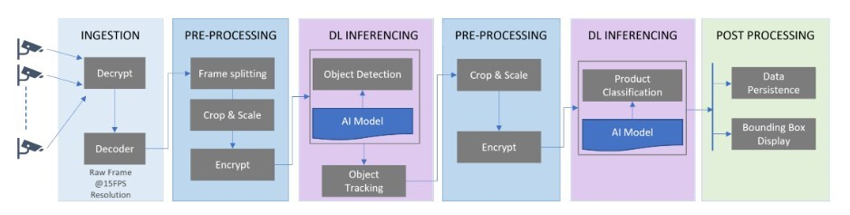
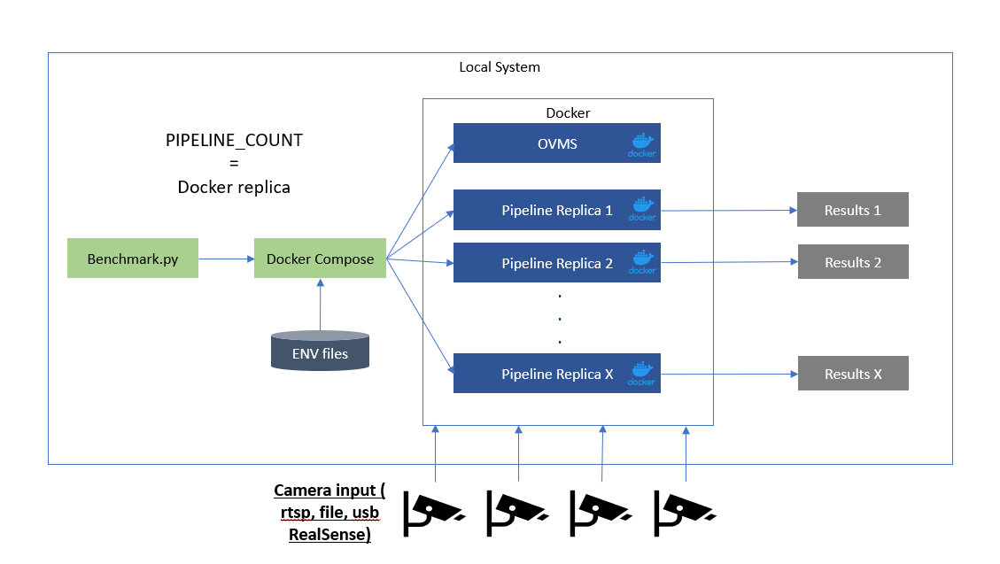

# Automated Self Checkout

Dockerized performance tool suite for benchmarking a use case.

## Overview

As Computer Vision becomes more and more mainstream, especially for industrial & retail use cases, development and deployment of these solutions becomes more challenging. Vision workloads are large and complex and need to go through many stages. For instance, in the pipeline below, the video data is ingested, pre-processed before each inferencing step, inferenced using two models - YOLOv5 and EfficientNet, and post processed to generate metadata and show the bounding boxes for each frame. This pipeline is just an example of the supported models and pipelines found within this reference.

[](../images/vision-data-flow.jpg)

## How it Works

Automated self-checkout solutions are complex, and retailers, independent software vendors (ISVs), and system integrators (SIs) require a good understanding of hardware and software, the costs involved in setting up and scaling the system, and the configuration that best suits their needs. Vision workloads are significantly larger and require systems to be architected, built, and deployed with several considerations. Hence, a set of ingredients needed to create an automated self-checkout solution is necessary. 
The Intel® Automated Self-Checkout Reference Package provides critical components required to build and deploy a self-checkout use case using Intel® hardware, software, and other open-source software. This reference implementation provides a pre-configured automated self-checkout pipeline that is optimized for Intel® hardware. The solution includes profiles and optimization using Open Vino Model Server (OVMS) as shown in the figure below.


### Automated Self Checkout Architecture Diagram

[](../images/dlstreamer-pipeline.png)

The reference solution also includes a set of benchmarking tools, shown in the image below, to evaluate the workload on different hardware platforms. This reference solution will help evaluate your required hardware to minimize the cost per workload.

### Benchmarking Tool Suite Architecture Diagram

[](../images/performance-pipeline-ovms.png)


# Automated Self Checkout

> **Warning**  
> The **main** branch of this repository contains work-in-progress development code for the upcoming release, and is **not guaranteed to be stable or working**.
>
> **The source for the latest release can be found at [Releases](https://github.com/intel-retail/automated-self-checkout/releases).**

## Prerequisites

- [Docker](https://docs.docker.com/engine/install/ubuntu/) 
- [Manage Docker as a non-root user](https://docs.docker.com/engine/install/linux-postinstall/)
- [Docker Compose v2](https://docs.docker.com/compose/) (Optional)
- Intel hardware (CPU, GPU, dGPU)

## QuickStart

(If this is the first time, it will take some time to download videos, models, docker images and build containers)

```
make run-demo
```

stop containers:

```
make down
```

## [Advanced Documentation](https://intel-retail.github.io/documentation/use-cases/automated-self-checkout/automated-self-checkout.html)

## Join the community 
[](https://discord.gg/2SpNRF4SCn)

## References

- [Developer focused website to enable developers to engage and build our partner community](https://www.intel.com/content/www/us/en/developer/articles/reference-implementation/automated-self-checkout.html)

- [LinkedIn blog illustrating the automated self checkout use case more in detail](https://www.linkedin.com/pulse/retail-innovation-unlocked-open-source-vision-enabled-mohideen/)

## Disclaimer

GStreamer is an open source framework licensed under LGPL. See https://gstreamer.freedesktop.org/documentation/frequently-asked-questions/licensing.html?gi-language=c.  You are solely responsible for determining if your use of Gstreamer requires any additional licenses.  Intel is not responsible for obtaining any such licenses, nor liable for any licensing fees due, in connection with your use of Gstreamer.

Certain third-party software or hardware identified in this document only may be used upon securing a license directly from the third-party software or hardware owner. The identification of non-Intel software, tools, or services in this document does not constitute a sponsorship, endorsement, or warranty by Intel.

## Datasets & Models Disclaimer

To the extent that any data, datasets or models are referenced by Intel or accessed using tools or code on this site such data, datasets and models are provided by the third party indicated as the source of such content. Intel does not create the data, datasets, or models, provide a license to any third-party data, datasets, or models referenced, and does not warrant their accuracy or quality.  By accessing such data, dataset(s) or model(s) you agree to the terms associated with that content and that your use complies with the applicable license.

Intel expressly disclaims the accuracy, adequacy, or completeness of any data, datasets or models, and is not liable for any errors, omissions, or defects in such content, or for any reliance thereon. Intel also expressly disclaims any warranty of non-infringement with respect to such data, dataset(s), or model(s). Intel is not liable for any liability or damages relating to your use of such data, datasets or models.

## License
This project is Licensed under an Apache [License](./LICENSE.md).
