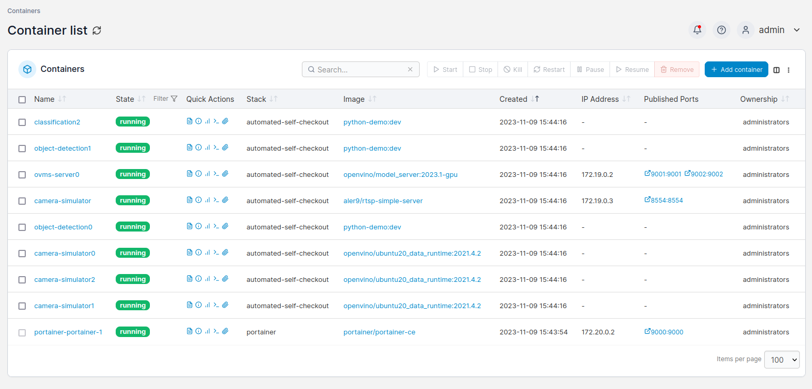

# Docker-Compose for Developer Toolbox

Pipelines can be run using docker-compose files. Changes are custom made inside  the docker-compose for integration with the Developer Toolbox.

!!! Note
    To utilize all the features offered by Automated Self-Checkout, run the pipelines as illustrated in the section [Run Pipelines](./quick_pipelinerun.md).

## Steps to Run Pipelines

1. Prerequisites

    Before running, [Set Up the Pipelines](./pipelinesetup.md).

1. Customize the `docker-compose.yml` to add the number of camera simulators required and the number of different type of pipelines that need to be run

    !!! Note
        Follow all the instructions in `docker-compose.yml` for customizations.

1. Run the pipelines

    ```bash
    make run-pipelines
    ```

1. All the containers i.e camera simulators, OVMS server and pipelines should start without any errors in portainer as shown below in Figure 1 -

    <figure class="figure-image">
    
    <figcaption>Figure 1: Pipelines Running Successfully</figcaption>
    </figure>

1. Stop the pipeline

    ```bash
    make down-pipelines
    ```
