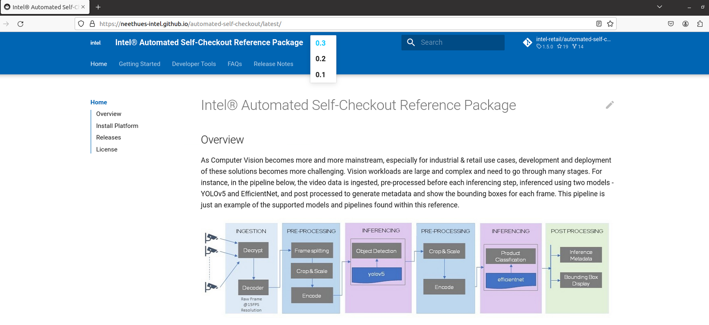

# Documentation Tools

1. Project uses [mkdocs](https://www.mkdocs.org/) and [mkdocs-material](https://squidfunk.github.io/mkdocs-material/) to maintain the documentation on github pages.

2. Github page deployments are automated via github-actions - [page-build-deployment](https://github.com/intel-retail/automated-self-checkout/actions/workflows/pages/pages-build-deployment) and [Update GH Pages](https://github.com/intel-retail/automated-self-checkout/actions/workflows/gh-pages.yml),  which get executed everytime a branch with documentation changes is merged into the main branch

3. Documentation versioning is implemented using the [mike](https://squidfunk.github.io/mkdocs-material/setup/setting-up-versioning/) tool.

## Mike Tool Usage

1. Make sure [page-build-deployment](https://github.com/intel-retail/automated-self-checkout/actions/workflows/pages/pages-build-deployment) and [Update GH Pages](https://github.com/intel-retail/automated-self-checkout/actions/workflows/gh-pages.yml) are working
    
    !!! note
        Mike tool works with Github Pages(**gh-pages**), versioning changes will appear only after they are deployed to **gh-pages** via github actions. To run them locally, use the following command to view documentation at *http://localhost:8000/*
        ```bash
        mike serve
        ```

2. Install mike tool on local development environment

    ```bash
    pip install mike
    ```

3. Make the documentation changes and check in the code.

4. Alias for documentation default version is set as **latest**. If required, this can be changed -

    ```bash
    mike set-default --push latest
    ```

4. Publish a new version of project documentation by choosing a version identifier and update the alias set as the default version with -

    ```bash
    mike deploy --push --update-aliases 0.1 latest
    ```

5. Every version will be deployed as a subdirectory of **site_url** set in mkdocs.yaml. Example the documentation will be published to URLs such as:

    ```bash
    https://intel-retail.github.io/automated-self-checkout/0.1/
    https://intel-retail.github.io/automated-self-checkout/0.2/
    ```

6. After PR is merged into the main branch, github actions will deploy the **gh-pages** and version dropdown on the documentation page will populate the new version as shown below

    

7. To delete versions, use the following commands -

    ```bash
    mike delete [version identifier]...
    ```

8. To list versions, use the following commands -

    ```bash
    mike list
    ```