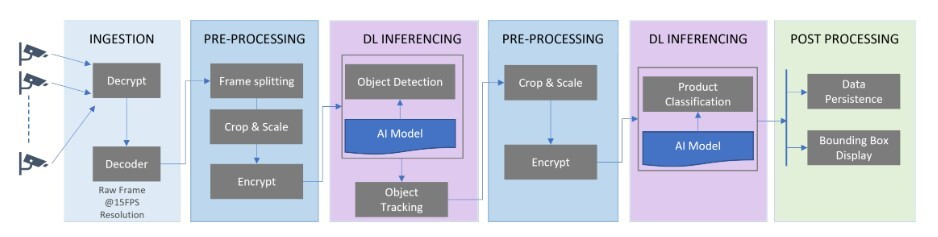
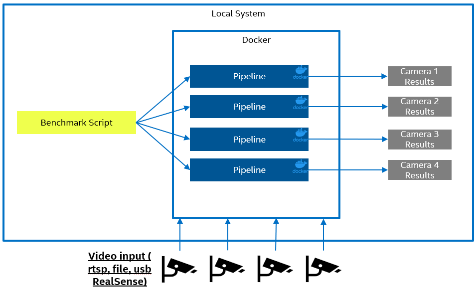

# Intel® Automated Self-Checkout Reference Package

## Overview

As Computer Vision becomes more and more mainstream, especially for industrial & retail use cases, development and deployment of these solutions becomes more challenging. Vision workloads are large and complex and need to go through many stages. For instance, in the pipeline below, the video data is ingested, pre-processed before each inferencing step, inferenced using two models - yolov5 and efficientnet, and post processed to generate metadata and show the bounding boxes for each frame.

Automated self-checkout solutions are complex, and retailers, independent software vendors (ISVs), and system integrators (SIs) require a good understanding of hardware and software, the costs involved in setting up and scaling the system, and the configuration that best suits their needs. Vision workloads are significantly larger and require systems to be architected, built, and deployed with several considerations. Hence, a set of ingredients needed to create an automated self-checkout solution is necessary. More details are available on the [Intel Developer Focused Webpage](https://www.intel.com/content/www/us/en/developer/articles/reference-implementation/automated-self-checkout.html) and on this [LinkedIn Blog](https://www.linkedin.com/pulse/retail-innovation-unlocked-open-source-vision-enabled-mohideen/)

The Intel® Automated Self-Checkout Reference Package provides critical components required to build and deploy a self-checkout use case using Intel® hardware, software, and other open-source software. This reference implementation provides a pre-configured automated self-checkout pipeline that is optimized for Intel® hardware.  The reference solution also includes a set of benchmarking tools to evaluate the workload on different hardware platforms. This reference solution will help evaluate your required hardware to minimize the cost per workload.

## Install Platform

Make sure that your platform is included in the [supported platform list](./platforms.md). To set up the platform, refer to [Hardware Setup](./hardwaresetup.md).

## Releases

For the project release notes, refer to the [GitHub* Repository](https://github.com/intel-retail/Automated-self-checkout/releases).

## License
This project is Licensed under an Apache [License](./LICENSE.md).