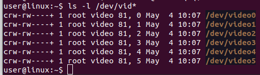
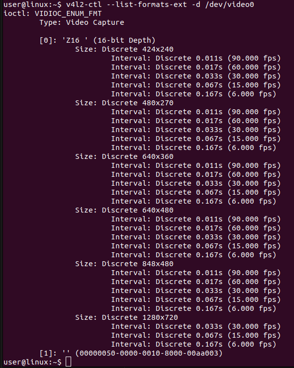

# How to query a usb camera

## Camera Hardware setup
- make sure an usb camera is plugged into the system

## Libray to be installed

`sudo apt update; apt install v4l-utils -y`

## List camera video availability

`ls -l /dev/vid*`

[](./images/list_dev_videos.png)

## Execute a video (select one from above list) for more information

`v4l2-ctl --list-formats-ext -d /dev/video0`

[](./images/execute_a_dev_video.png)

## Example to run the pipeline with usb camera on video0 for Core system
```
./docker-run.sh --platform core --inputsrc /dev/video0
```
