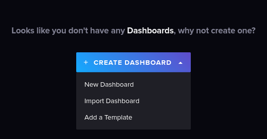
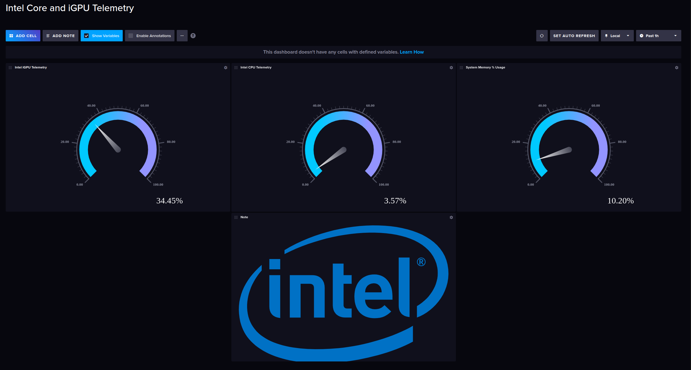

# Setup Telemetry

## Build Telegraf docker image

```bash
make build-telegraf
```

## Run InfluxDB and Telegraf

Set password for InfluxDB as env variable in command line:

**_Note:_** Password must be at least 8 characters in length.

```bash
make INFLUXPASS=yourpass run-telegraf
```

## Start Dashboard:

Open a browser to <a href="http://127.0.0.1:8086" target="_blank">http://127.0.0.1:8086</a> and login using username: **telegraf** and the password you set previously.

## Import Template

Click on "Build a Dashboard", then "Import dashboard" and select the file **intel_core_and_igpu_telemetry.json** under telegraf folder.



## Run Dashboard

