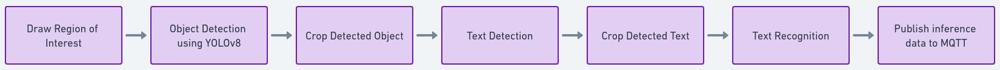

# Automated checkout using yolov8, text detection and recognition models with OpenVINO™

This Jupyter notebook demonstrates an automated checkout system that integrates object detection and text detection/recognition AI models. Utilizing YOLOv8 for object detection, the notebook efficiently identifies various items within a checkout frame, leveraging its robust and precise detection capabilities. To complement this, the notebook incorporates text detection and recognition within designated regions of interest. This combination allows for the extraction and interpretation of textual information—such as product labels and prices—from the detected items, facilitating a seamless and automated checkout process. The notebook is designed with detailed code explanations and visual outputs, making it accessible for users to understand and adapt the technology for various retail environments.

The tutorial consists of the following steps:
- Download the necessary models
- Convert the models to OpenVINO IR.
- Load models to OpenVINO engine 
- Perform object detection using yolov8, text detection and recognition. 
- Live demo


## Flow diagram



## Open in Google Colab

<a href="https://colab.research.google.com/github/antoniomtz/automated-self-checkout/blob/main/notebooks/automated-checkout.ipynb" target="_blank"></a>

## Installation

### Build docker image

```
$ docker build . -t automated-checkout
```

### Run docker container

```
docker run -it --device=/dev/dri --device=/dev/video0 --privileged --group-add=$(stat -c "%g" /dev/dri/render* | head -n 1) -p 8888:8888 automated-checkout
```

It will prompt the jupyter lab URL on the console, copy and paste it on your browser:

```
Or copy and paste one of these URLs:
        http://localhost:8888/lab?token=<token>
```

## Run it locally

Run the following commands to create a virtual env on your local system

Clone repo:
```
$ git clone https://github.com/intel-retail/automated-self-checkout.git
$ cd automated-self-checkout/notebooks
```

Create python virtual env:

```
python3 -m venv checkout
source checkout/bin/activate
pip install jupyterlab
```

Run jupyter notebook:

```
jupyter lab automated-checkout.ipynb
```

### TODO

- Include Classification model
- Barcode detection and encoding